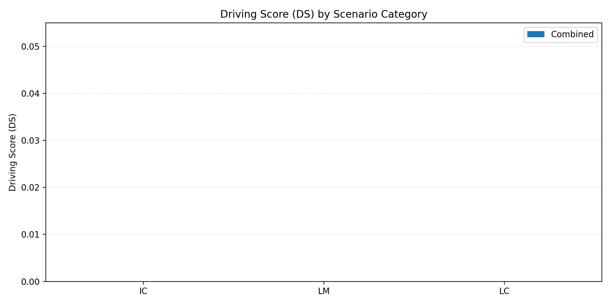
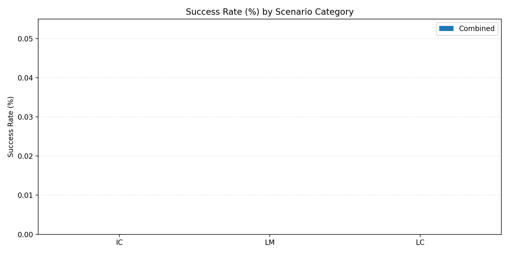
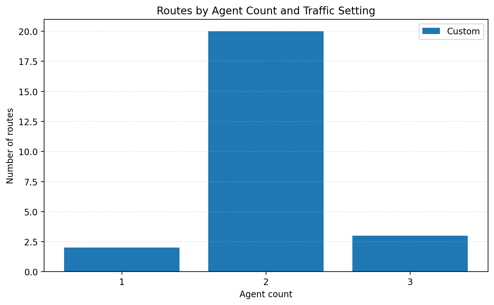
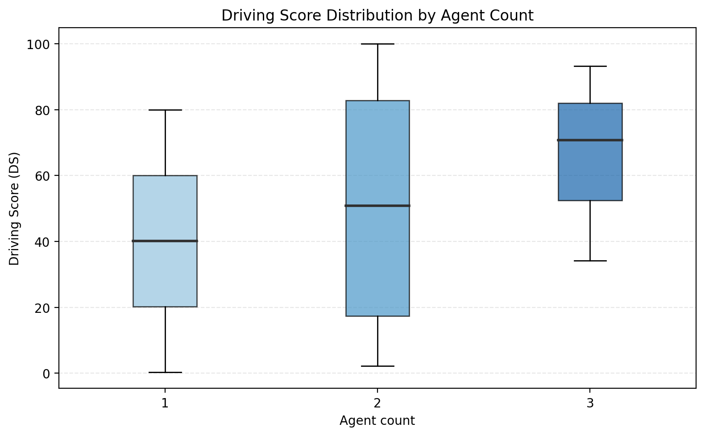
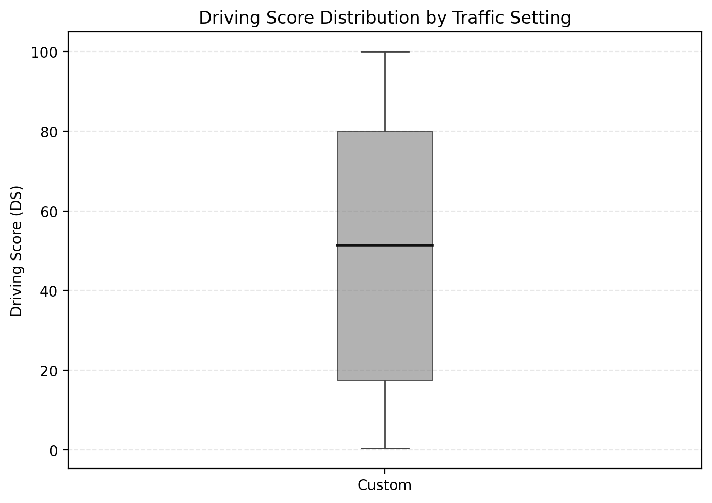
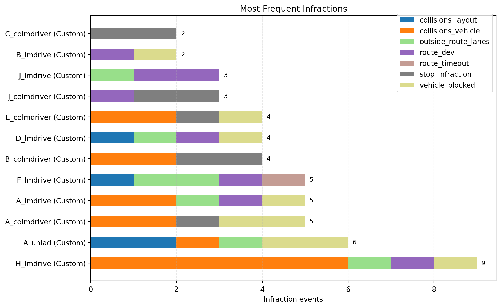

# Experiment Report · results_driving_custom

## Overview
- Total route evaluations: **25** (No NPC: 0, NPC: 0)
- Unique route scenarios: **25**
- Aggregated ego runs: **51**
- Average driving score (DS): **52.04**
- Average success rate: **25.3%**

## Visual Highlights

## Per-Route Summary
[Download full per-route dataset](tables/per_route_summary.csv)

Top 15 routes by driving score:
| Route                 | Mode   | Category   |     DS |     RC |    IS | Success   |   Game Time (s) |
|-----------------------|--------|------------|--------|--------|-------|-----------|-----------------|
| F_colmdriver          | Custom | Other      | 100    | 100    | 1     | 100.0%    |           13.1  |
| G_lmdrive             | Custom | Other      | 100    | 100    | 1     | 100.0%    |            8.2  |
| L_colmdriver          | Custom | Other      | 100    | 100    | 1     | 100.0%    |           11.5  |
| L_lmdrive             | Custom | Other      | 100    | 100    | 1     | 100.0%    |           14.45 |
| I_colmdriver          | Custom | Other      |  93.33 | 100    | 0.933 | 66.7%     |          371.65 |
| G_colmdriver          | Custom | Other      |  91.23 |  91.23 | 1     | 0.0%      |           26.05 |
| C_colmdriver          | Custom | Other      |  80    | 100    | 0.8   | 0.0%      |           60.75 |
| D_colmdriver          | Custom | Other      |  80    | 100    | 0.8   | 0.0%      |           61.6  |
| myscenario_colmdriver | Custom | Other      |  80    | 100    | 0.8   | 0.0%      |          104.55 |
| I_lmdrive             | Custom | Other      |  70.81 |  70.81 | 1     | 66.7%     |           69.25 |
| J_colmdriver          | Custom | Other      |  54.6  |  72.6  | 0.82  | 0.0%      |          110.7  |
| K_colmdriver          | Custom | Other      |  54.27 |  54.27 | 1     | 50.0%     |           51.05 |
| F_lmdrive             | Custom | Other      |  51.36 |  68.95 | 0.741 | 0.0%      |           46.05 |
| K_lmdrive             | Custom | Other      |  50.44 |  50.67 | 0.825 | 50.0%     |           43.55 |
| B_colmdriver          | Custom | Other      |  48    | 100    | 0.48  | 0.0%      |           51    |

Routes with the lowest driving scores:
| Route        | Mode   |    DS | Success   |   Game Time (s) |
|--------------|--------|-------|-----------|-----------------|
| new          | Custom |  0.32 | 0.0%      |           34.05 |
| A_uniad      | Custom |  2.18 | 0.0%      |           60.35 |
| E_lmdrive    | Custom |  3.36 | 0.0%      |           13.25 |
| A_colmdriver | Custom | 12.62 | 0.0%      |           75.9  |
| A_lmdrive    | Custom | 12.97 | 0.0%      |           67.25 |
| B_lmdrive    | Custom | 17.12 | 0.0%      |           61.5  |
| D_lmdrive    | Custom | 17.36 | 0.0%      |           52.4  |
| J_lmdrive    | Custom | 21    | 0.0%      |           51.05 |
| E_colmdriver | Custom | 25.9  | 0.0%      |          106.45 |
| H_lmdrive    | Custom | 34.2  | 0.0%      |           81.7  |

## Agent Composition
|   Agents |   Routes |   No NPC |   NPC |   Avg DS |   Avg Negotiations |
|----------|----------|----------|-------|----------|--------------------|
|        1 |        2 |        0 |     0 |    40.16 |                  0 |
|        2 |       20 |        0 |     0 |    51.12 |                  0 |
|        3 |        3 |        0 |     0 |    66.11 |                  0 |

## Communication Analysis
No negotiations were recorded in these runs.

## Category Summaries
### Combined
| Category   |   Routes |    DS |    RC |    IS | Success   |   Game Time (s) |
|------------|----------|-------|-------|-------|-----------|-----------------|
| Total      |       25 | 52.04 | 60.69 | 0.805 | 25.3%     |           65.89 |
| IC         |        0 |  0    |  0    | 0     | 0.0%      |            0    |
| LM         |        0 |  0    |  0    | 0     | 0.0%      |            0    |
| LC         |        0 |  0    |  0    | 0     | 0.0%      |            0    |
[Download CSV](tables/category_summary_Combined.csv)

## Infractions
[Download detailed infractions](tables/infractions.csv)

Each value represents the number of times that infraction occurred. Multiple counts for the same infraction indicate repeated events within the same route run.

Total infraction events observed across all evaluations:
- **collisions_vehicle**: 15
- **stop_infraction**: 12
- **route_dev**: 11
- **vehicle_blocked**: 10
- **outside_route_lanes**: 7
- **collisions_layout**: 6
- **route_timeout**: 4

- **A_colmdriver** (Custom): collisions_vehicle: 2, stop_infraction: 1, vehicle_blocked: 2
- **A_lmdrive** (Custom): collisions_vehicle: 2, outside_route_lanes: 1, route_dev: 1, vehicle_blocked: 1
- **A_uniad** (Custom): collisions_layout: 2, collisions_vehicle: 1, outside_route_lanes: 1, vehicle_blocked: 2
- **B_colmdriver** (Custom): collisions_vehicle: 2, stop_infraction: 2
- **B_lmdrive** (Custom): route_dev: 1, vehicle_blocked: 1
- **C_colmdriver** (Custom): stop_infraction: 2
- **D_colmdriver** (Custom): stop_infraction: 2
- **D_lmdrive** (Custom): collisions_layout: 1, outside_route_lanes: 1, route_dev: 1, vehicle_blocked: 1
- **E_colmdriver** (Custom): collisions_vehicle: 2, stop_infraction: 1, vehicle_blocked: 1
- **E_lmdrive** (Custom): route_dev: 2
- **F_lmdrive** (Custom): collisions_layout: 1, outside_route_lanes: 2, route_dev: 1, route_timeout: 1
- **G_colmdriver** (Custom): route_timeout: 2
- **H_lmdrive** (Custom): collisions_vehicle: 6, outside_route_lanes: 1, route_dev: 1, vehicle_blocked: 1
- **I_colmdriver** (Custom): stop_infraction: 1
- **I_lmdrive** (Custom): route_dev: 1
- **J_colmdriver** (Custom): route_dev: 1, stop_infraction: 2
- **J_lmdrive** (Custom): outside_route_lanes: 1, route_dev: 2
- **K_colmdriver** (Custom): route_timeout: 1
- **K_lmdrive** (Custom): collisions_layout: 1, vehicle_blocked: 1
- **myscenario_colmdriver** (Custom): stop_infraction: 1
- **new** (Custom): collisions_layout: 1

## Unmatched Routes
[Download unmatched routes list](tables/unmatched_routes.csv)
- A_colmdriver (Custom)
- A_lmdrive (Custom)
- A_uniad (Custom)
- B_colmdriver (Custom)
- B_lmdrive (Custom)
- C_colmdriver (Custom)
- D_colmdriver (Custom)
- D_lmdrive (Custom)
- E_colmdriver (Custom)
- E_lmdrive (Custom)
- F_colmdriver (Custom)
- F_lmdrive (Custom)
- G_colmdriver (Custom)
- G_lmdrive (Custom)
- H_lmdrive (Custom)
- I_colmdriver (Custom)
- I_lmdrive (Custom)
- J_colmdriver (Custom)
- J_lmdrive (Custom)
- K_colmdriver (Custom)
- K_lmdrive (Custom)
- L_colmdriver (Custom)
- L_lmdrive (Custom)
- myscenario_colmdriver (Custom)
- new (Custom)
